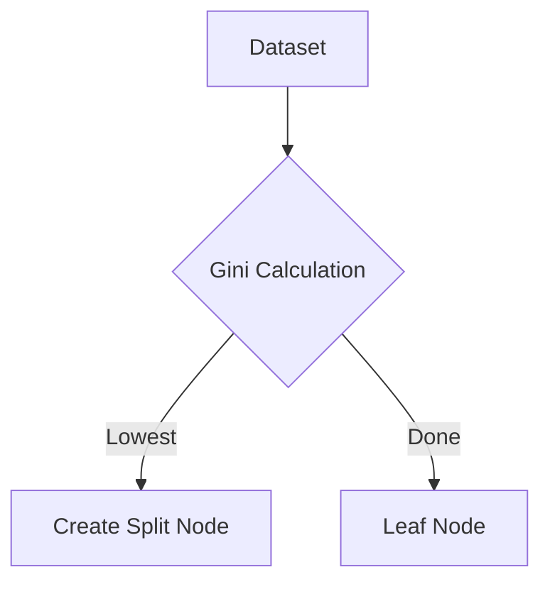
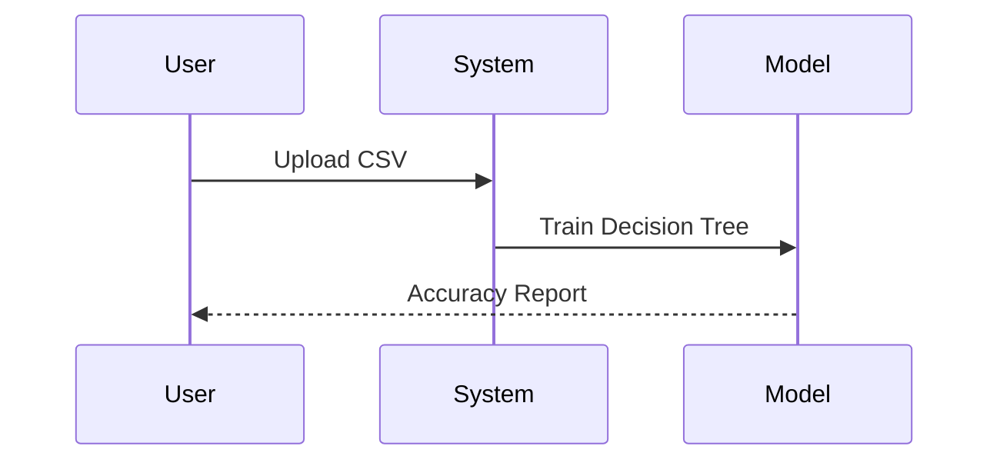

# 📖 Lectura — User Guide

This guide provides detailed instructions on how to set up, configure, and create presentations using the **Lectura** Academic Presentation System.

---

## 🚀 Getting Started

> [!IMPORTANT]
> The system uses `fetch()` to load the content files (`content-en.md` or `content-id.md`) and `config.json`. **Do not** open `index.html` directly via `file://` — it will throw a CORS error.

You need a local HTTP server. Pick your weapon:

<details>
<summary><b>🔌 VS Code Live Server</b> (Recommended)</summary>

1. Install the **Live Server** extension by Ritwick Dey
2. Click **Go Live** in the bottom-right corner
3. Browser opens at `http://127.0.0.1:5500/`
</details>

<details>
<summary><b>🐍 Python</b> (Zero install)</summary>

```bash
# Python 3.x
python3 -m http.server 8000

# Python 2.x
python -m SimpleHTTPServer 8000
```
Open `http://localhost:8000/`
</details>

<details>
<summary><b>⬡ Node.js http-server</b></summary>

```bash
npx http-server -p 8080
```
Open `http://localhost:8080/`
</details>

---

## ⚙️ Configuration

Global settings live in [`config.json`](config.json):

```json
{
  "presentationMinutes": 3,
  "baseFontSize": "18pt",
  "presentationTitle": "Sidang Tesis: Arsitektur Hibrida Lectura",
  "authorName": "Telo Godhok",
  "institutionInfo": "Institute Tambal Ban (ITB)",
  "studyProgram": "Teknik Tambal Ban",
  "lang": "id",
  "revealTheme": "black",
  "timerStartText": "START",
  "timerResetText": "RESET",
  "themeToggleTitle": "Toggle Dark/Light Mode",
  "aspectRatio": "16:9",
  "contentFile": "content-id.md"
}
```

| Key | Type | Description |
|-----|------|-------------|
| `presentationMinutes` | Number | Countdown duration (e.g. `3` minutes) |
| `baseFontSize` | String | Base font (`18pt` / `20px`); affects Mermaid sizing |
| `presentationTitle` | String | `<title>` tag content |
| `authorName` | String | Left footer + `{{authorName}}` placeholder |
| `institutionInfo` | String | Center footer + `{{institutionInfo}}` placeholder |
| `studyProgram` | String | `{{studyProgram}}` placeholder |
| `lang` | String | HTML `lang` attribute (`"id"` / `"en"`) |
| `revealTheme` | String | Reveal.js theme (`"black"`, `"white"`, `"league"`, etc.) |
| `timerStartText` | String | Start button label |
| `timerResetText` | String | Reset button label |
| `themeToggleTitle` | String | Theme toggle tooltip |
| `aspectRatio` | String | Presentation ratio (`"16:9"` or `"4:3"`) |
| `contentFile` | String | Path to markdown content file |

---

## 📝 Writing Slides

Slides are authored sequentially in `content-en.md` (English) or `content-id.md` (Bahasa Indonesia) depending on the configuration. Two rules to remember:

### 🔹 1. Slide Separation

Use the exact divider between slides:

```markdown
---slide-break---
```

> [!WARNING]
> No spaces or extra characters around `---slide-break---`.

### 🔹 2. Metadata (HTML Comments)

Precede each slide with comment-based metadata:

```markdown
<!-- layout: 2-content-with-text -->
<!-- title: Landasan Teori: Algoritma Decision Tree -->
<!-- section: Landasan Teori -->
<!-- left-title: Teori Entropi -->
<!-- right-title: Teori Gini Impurity -->
```

### 🔹 3. Internal Content Split

For multi-column/row layouts, divide content with:

```markdown
<!-- split -->
```

Content before `<!-- split -->` → first area (left / top)
Content after → second area (right / bottom)

---

## 🎨 Slide Layouts

Lectura ships **9 layout types**. If none specified, `1-content-with-text` is used as default.

Content inside layouts (except `title`, `closing`, and `*-grid`) is auto-wrapped in `academic-box` containers.

---

### 📍 1. `title` — Title Slide

Full academic title page with centered logo, thesis title, and author details.

| Metadata | Description |
|----------|-------------|
| `logo` | Path to institution logo (e.g. `assets/University-logo.png`) |
| `state` | `hide-header-footer` to hide nav UI |

```markdown
<!-- layout: title -->
<!-- logo: assets/University-logo.png -->
<!-- state: hide-header-footer -->

# THESIS
## PERFORMANCE ANALYSIS OF DECISION TREE METHOD ON MEDICAL DATA
### Informatics Engineering — Universitas Dian Nuswantoro

<div class="title-details">
<strong>Prepared By:</strong> Praditya Wicaksono<br>
<strong>Student ID:</strong> A11.2022.12345<br><br>
<strong>Advisors:</strong><br>
Prof. Dr. Main Advisor, M.Kom.<br>
Dr. Co-Advisor, M.Kom.
</div>
```

---

### 📍 2. `closing` — Closing Slide

Centered closing remarks with large typography.

| Metadata | Description |
|----------|-------------|
| `state` | `hide-header-footer` to hide nav UI |

```markdown
<!-- layout: closing -->
<!-- state: hide-header-footer -->

# THANK YOU

### Q&A Session

Questions, suggestions, and feedback are welcome for the improvement of this research.
```

---

### 📍 3. `1-content-with-text` (Default) — Full Width

Single full-width `academic-box`. Perfect for long explanations.

```markdown
<!-- layout: 1-content-with-text -->
<!-- title: Background of the Problem -->
<!-- section: Introduction -->

The background of this research is motivated by the high rate of disease X spread…
- Lifestyle and genetic factors are the main determinants.
- An AI-based classification system is needed for accurate early detection.
```

---

### 📍 4. `1-column-stacked` — Vertical Stack

Two stacked rows (top + bottom). Great for cause-effect or sequential steps.

| Metadata | Description |
|----------|-------------|
| `top-title` | Title for the top box |
| `bottom-title` | Title for the bottom box |

```markdown
<!-- layout: 1-column-stacked -->
<!-- title: Methodology: Data Separation & Training -->
<!-- top-title: 1. Data Preprocessing -->
<!-- bottom-title: 2. Model Training Process -->
<!-- section: Methodology -->

At this stage, the data is cleaned of missing values and scale normalization is performed.

<!-- split -->

The Decision Tree algorithm is trained using the Gini Impurity criterion with a maximum tree depth of 5.
```

---

### 📍 5. `2-content-with-text` — Side by Side

Two equal columns. Ideal for comparison (pros/cons, before/after).

| Metadata | Description |
|----------|-------------|
| `left-title` | Title for the left column |
| `right-title` | Title for the right column |

```markdown
<!-- layout: 2-content-with-text -->
<!-- title: Classification Algorithm Analysis -->
<!-- left-title: Advantages of Decision Tree -->
<!-- right-title: Disadvantages of Decision Tree -->
<!-- section: Theoretical Foundation -->

- Easy to understand and interpret.
- Does not require complex data preparation.
- Can handle both nominal and numerical data.

<!-- split -->

- Prone to overfitting if the tree is too deep.
- Unstable with small changes in training data.
- Biased toward attributes with many classes.
```

---

### 📍 6. `3-content-with-text` — Triple Column

Three equal columns for tri-component classifications or three-pillar methodologies.

| Metadata | Description |
|----------|-------------|
| `left-title` | Left column title |
| `center-title` | Center column title |
| `right-title` | Right column title |

```markdown
<!-- layout: 3-content-with-text -->
<!-- title: System Pipeline Architecture -->
<!-- left-title: Input -->
<!-- center-title: Process -->
<!-- right-title: Output -->
<!-- section: Methodology -->

Raw medical dataset in CSV format.

<!-- split -->

Feature extraction and Entropy/Gini calculation.

<!-- split -->

Classification results in the form of patient diagnosis status.
```

---

### 📍 7. `2-content-with-img` — Image + Text

Image on the left, `academic-box` text on the right. Supports **Image Lightbox**.

| Metadata | Description |
|----------|-------------|
| `image` | Image path (e.g. `assets/chart.jpg`) |

```markdown
<!-- layout: 2-content-with-img -->
<!-- image: assets/placeholder.png -->
<!-- title: Decision Tree Visualization Analysis -->
<!-- section: Results -->

- The image on the side shows the decision tree structure from training.
- The root node is determined by the feature with the highest *Information Gain*.
- This tree structure has an optimal depth of 4 levels.
```

---

### 📍 8. `2-column-grid` — Free Grid

Two side-by-side columns **without** `academic-box` wrapping. Full CSS freedom.

```markdown
<!-- layout: 2-column-grid -->
<!-- title: Free Grid Customization -->
<!-- section: Theoretical -->

<div style="background: rgba(0,0,0,0.2); padding: 20px; border-radius: 10px;">
    <h3>Custom Left Block</h3>
    Content without Lectura's built-in academic box.
</div>

<!-- split -->

<div style="background: rgba(255, 0, 0, 0.1); padding: 20px; border-radius: 10px; border: 1px solid red;">
    <h3>Custom Right Block</h3>
    Using inline HTML styling directly.
</div>
```

---

### 📍 9. `2-content-center-mermaid` — Diagram + Text

Large centered Mermaid diagram on top, description below in an `academic-box`.

```markdown
<!-- layout: 2-content-center-mermaid -->
<!-- title: Decision Tree Formation Methodology Flow -->
<!-- section: Methodology -->



<!-- split -->

The flowchart above illustrates the C4.5 algorithm in determining split nodes recursively until the data is fully classified into leaf nodes.
```

---

## 📐 Academic Features

### ➗ MathJax 3 — LaTeX Equations

Inline with `$...$`, blocks with `$$...$$`. IEEE-style auto-numbering uses:

```markdown
$$H(D) = -\sum_{i=1}^{c} p_i \log_2 p_i$$ (3.2)
```

The `(3.2)` floats neatly to the right.

### 📊 Booktabs Tables

Standard Markdown tables are rendered as **Booktabs** — horizontal rules only at top, header-bottom, and bottom (no vertical lines).

```markdown
| Parameter | Initial Value | Final Value | Accuracy |
| :--- | :--- | :--- | :--- |
| Scenario 1 | 0.12 | 0.85 | 89.2% |
| Scenario 2 | 0.18 | 0.92 | **92.4%** |
```

### 📈 Mermaid Diagrams

Full Mermaid support (flowchart, sequence, ER, etc.). The engine uses a neutral theme with white background (`#ffffff`), gray border, and high-contrast text in both light and dark modes.

```markdown

```

### 📝 Footnotes & Sources

Reference citations within slides:

```markdown
According to the study[^1], the results confirm…

[^1)] Source: Praditya et al., Journal of Information Technology, 2026.
```

The parser collects all footnotes per slide into a dedicated bottom container.

---

## 🎮 Interactive Controls

| Feature | Description |
|---------|-------------|
| **📖 Chapter Tabs** | Top header with labeled chapter tabs. Active = highlighted, completed = green dimmed. Click to jump to that chapter. |
| **⏱️ Timer + Alert** | Countdown from `presentationMinutes`. START/RESET buttons. ⚠️ Blinks crimson red when ≤2 min remain. Stays red at `00:00`. |
| **🖼️ Image Lightbox** | Click any image → full-screen overlay. Close via ✕, click outside, or `Escape` key. |
| **🃏 Card Interaction** | `academic-box` cards respond with subtle shadow + scale on hover. Clicked card retains `is-interacting` highlight. |
| **🌓 Theme Toggle** | Dark/Light mode switch. Preference saved in `localStorage` — persists on reload. |
| **🚀 Enhanced Navigation** | High-visibility floating arrows (80px) with 5em icons, interactive 1.15x hover scaling, and elevated positioning (110px) for maximum accessibility. |
| **🛡️ Navigation Protection** | Blocks accidental close/reload (`beforeunload`). Disables swipe-back gestures and pull-to-refresh to protect Reveal.js navigation. |

---

<div align="center">
  <a href="README.md">← Back to README</a>
</div>
