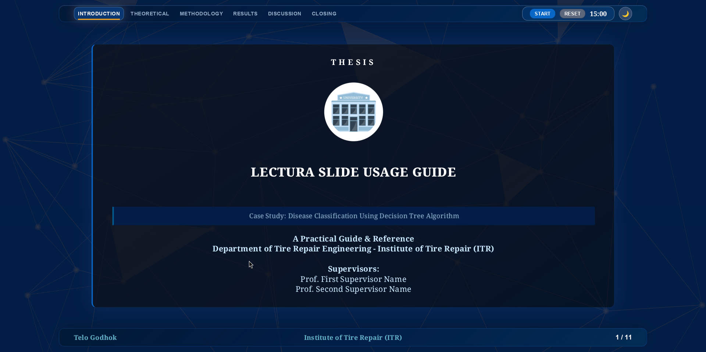
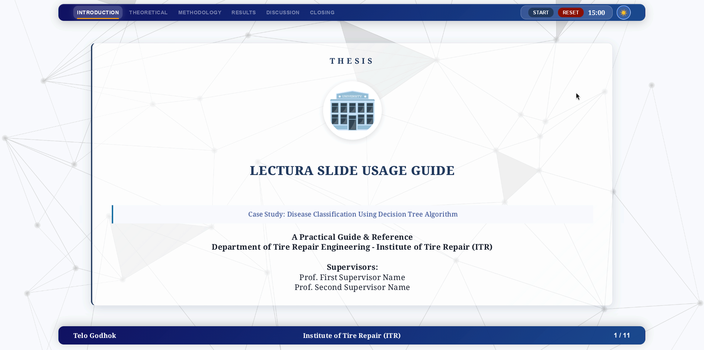

<div align="center">

# 📖 Lectura — Academic Presentation System

> **Academic Dashboard** — Present your thesis, research, or seminar with elegance.

[](https://revealjs.com/)
[](LICENSE)
[]()

**Lectura** is a web-based academic slide platform that combines **Markdown** simplicity with 2 distinct aesthetic presets (modern *Glassmorphism* or traditional *Formal*) and *High-Contrast Dark Mode*, all powered by **Reveal.js**.

<p align="center">
  
  
</p>

</div>

---

## 📋 Table of Contents

- [✨ Features](#-features)
- [📁 Architecture & File Structure](#-architecture--file-structure)
- [🎨 CSS Architecture](#-css-architecture)
- [📖 User Guide (Documentation)](#-user-guide-documentation)
  - [🚀 Getting Started](GUIDE.md#-getting-started)
  - [⚙️ Configuration](GUIDE.md#️-configuration)
  - [📝 Writing Slides](GUIDE.md#-writing-slides)
  - [🎨 Slide Layouts](GUIDE.md#-slide-layouts)
  - [📐 Academic Features](GUIDE.md#-academic-features)
  - [🎮 Interactive Controls](GUIDE.md#-interactive-controls)

---

## ✨ Features

| Area | Highlights |
|------|------------|
| **Content** | Markdown-based ✅ LaTeX Math (MathJax 3) ✅ Mermaid Diagrams ✅ |
| **UI/UX** | Glassmorphism / Formal preset 🌓 Dark/Light Mode 🔖 Chapter Tabs ⏱️ Timer 📐 16:9 & 4:3 Ratios |
| **Layouts** | 9 slide layouts 🖼️ Image Lightbox 🎴 Booktabs Tables |
| **Control** | Server-side parsed 🛡️ Navigation Protection 🚀 Enhanced Navigation |

---

## 📁 Architecture & File Structure

The system is **server-side parsed**: slide content is dynamically read from external markdown files when the page loads, managed by modular ES modules.

```
📦 Lectura
├── 📄 index.html          # HTML scaffold + CDN deps
├── 📄 style.css           # CSS entrypoint — imports all 7 style layers
├── 📄 config.json         # Global settings (timer, theme, stylePreset, etc.)
├── 📄 GUIDE.md            # Detailed user guide & documentation 👈
├── 📄 content-id.md       # Slide content (Bahasa Indonesia)
├── 📄 content-en.md       # Slide content (English)
├── 📁 js/                 # ES Module codebase (19 modules orchestrated from main.js)
│   ├── 📄 main.js         # Entry point and initializations
│   ├── 📄 slides.js       # Core slide engine & Reveal.js setup
│   ├── 📄 config.js       # Configuration loader
│   └── ...
├── 📁 styles/             # CSS modules (7-layer clean architecture)
│   ├── 🎨 tokens.css      # Layer 1 — Design tokens & CSS variables
│   ├── 🎨 base.css        # Layer 2 — Reset, html/body, dark mode vars
│   ├── 🎨 typography.css  # Layer 3 — Headings, lists, blockquotes
│   ├── 🎨 layout.css      # Layer 4 — Slide layout, title/closing slides
│   ├── 🎨 components.css  # Layer 5 — Cards, tables, equations, mermaid
│   ├── 🎨 ui.css          # Layer 6 — Header, footer, timer, tools
│   └── 🎨 animations.css  # Layer 7 — Keyframes & animation utilities
├── 📁 assets/             # Assets directory (images, background)
│   ├── 🖼️ background.png  # Grid background overlay
│   └── ...
└── 📁 Noto_Serif/         # Custom font
```

### 🔧 Core Files

| File/Folder | Role |
|-------------|------|
| **[index.html](index.html)** | Loads Reveal.js, Marked.js, MathJax 3, Mermaid via CDN. |
| **[js/](js/)** | ES Module codebase that loads configuration, parses Markdown, and renders layouts. |
| **[style.css](style.css)** | CSS entrypoint — imports all 7 modular style layers from `styles/`. |
| **[config.json](config.json)** | Single source of truth for presentation metadata, theme toggles, and style presets. |
| **[GUIDE.md](GUIDE.md)** | **Complete documentation for setup and usage.** |

---

## 🎨 CSS Architecture

The stylesheet uses a **7-Layer Clean Architecture** — each file has a single responsibility. The entrypoint `style.css` only contains `@import` statements; all styles live in the `styles/` folder.

| Layer | File | Responsibility |
|-------|------|----------------|
| 1 | [`styles/tokens.css`](styles/tokens.css) | CSS custom properties (colors, shadows, gradients, widths) |
| 2 | [`styles/base.css`](styles/base.css) | Global reset, `html`/`body` stacking, dark mode variable overrides |
| 3 | [`styles/typography.css`](styles/typography.css) | Headings, dark mode text colors, lists, blockquotes |
| 4 | [`styles/layout.css`](styles/layout.css) | Slide sections, content wrapper, title & closing slides |
| 5 | [`styles/components.css`](styles/components.css) | Academic cards, tables, equations (MathJax), Mermaid, footnotes |
| 6 | [`styles/ui.css`](styles/ui.css) | Header, footer, timer, navigation, accessibility, overlay, tools |
| 7 | [`styles/animations.css`](styles/animations.css) | `@keyframes` & stagger animation utilities |

> **Cascade order** is intentional: lower layers (tokens) are always loaded before higher layers (components) that depend on their variables.

---

## 📖 User Guide (Documentation)

For complete instructions on how to use Lectura, please refer to the **[GUIDE.md](GUIDE.md)** file.

### Quick Links:
- **[🚀 How to Start](GUIDE.md#-getting-started)**
- **[⚙️ Configuration Options](GUIDE.md#️-configuration)**
- **[📝 How to Write Slides](GUIDE.md#-writing-slides)**
- **[🎨 Available Layouts](GUIDE.md#-slide-layouts)**

---

<div align="center">

**Built with ❤️ for thesis defenses, research seminars, and academic presentations.**

⭐ Star this repo if you find it useful!

</div>
