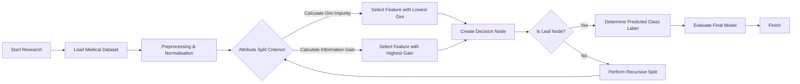

<!-- layout: title -->
<!-- logo: assets/University-logo.png -->
<!-- section: Introduction -->

# THESIS
## LECTURA SLIDE USAGE GUIDE

>Case Study: Disease Classification Using Decision Tree Algorithm

<div class="title-details">
<strong>A Practical Guide &amp; Reference</strong><br>
<strong>Department of {{studyProgram}} - {{institutionInfo}}</strong><br><br>
<strong>Supervisors:</strong><br>
Prof. First Supervisor Name<br>
Prof. Second Supervisor Name<br>
</div>

---slide-break---
<!-- layout: 2-content-with-text -->
<!-- title: Introduction: Background & Problem Formulation -->
<!-- left-title: Overview of the Lectura Slide System -->
<!-- right-title: Case Study: Decision Tree -->
<!-- section: Introduction -->

1.) **The Lectura Slide System** is designed specifically for academic presentations (thesis defenses) by combining the simplicity of Markdown writing with the visual power of Reveal.js.

2.) **Structural Visualization**: Slides are orchestrated by `script.js` and styled using `style.css`, featuring Glassmorphism aesthetics, Book Tabs navigation, and Interactive Cards.

3.) **Purpose of This Guide**: To assist users in optimising every available layout using a Decision Tree classification research case study.

[^1)] 1.1 Background of the Lectura Slide System

  <!-- split -->

**Problem Formulation:**
How to construct effective, informative, and interactive presentation slides for presenting the results of decision tree research?

**Research Objectives:**
1. **RQ1 (Design)**: Map the structure of Decision Tree thesis material into Lectura layout templates.
2. **RQ2 (Visualisation)**: Present decision tree visualisations, mathematical formulas (Gini/Entropy), and the training pipeline flow diagram optimally.
3. **RQ3 (Evaluation)**: Validate presentation performance by utilising Booktabs table visualisations and model performance metrics.

[^2)] 1.2 Problem Formulation

---slide-break---
<!-- layout: 1-column-stacked -->
<!-- title: Theoretical Foundation: Metadata & Syntax Procedures -->
<!-- top-title: 1. Configuring Slides via Metadata -->
<!-- bottom-title: 2. Slide Separation Mechanism -->
<!-- section: Theoretical -->

- **HTML Comment Syntax**: Each slide is preceded by metadata in the form of `<!-- key: value -->` comments to configure visual properties.
- **List of Metadata Keys**:
  - `layout`: determines the layout type (e.g., `title`, `1-content-with-text`, `2-content-with-text`, `1-column-stacked`, `2-content-with-img`).
  - `title`: slide title displayed in the floating header box.
  - `section`: menu/chapter category on the top navigation bar (*Book Tabs*).
  - `state`: set to `hide-header-footer` to conceal the header/footer (e.g., on title or closing slides).

[^1)] 2.1 Slide Configuration

<!-- split -->

- **Main Slide Separator**: Use a new line containing `---slide-break---` (with no extra spaces) to mark transitions between slide pages.
- **Internal Content Separator**: For layouts with multiple columns or rows (such as `2-content-with-text` or `1-column-stacked`), use the `<!-- split -->` separator within the slide content to divide text into separate academic boxes (`academic-box`).
- **Decision Tree Case Study**: Lengthy decision tree theoretical foundations can be broken into two parts (e.g., tree definition in the top section and entropy metrics in the bottom section).

[^2)] 2.2 Content Separation Rules

---slide-break---
<!-- layout: 2-content-with-text -->
<!-- title: Methodology: Stacked & Column Layout Configuration -->
<!-- left-title: Two-Column Layout Design -->
<!-- right-title: Case Study: Decision Tree Data Flow -->
<!-- section: Methodology -->

- **The `2-content-with-text` Layout**: Divides the slide horizontally into two columns of equal width.
- **Advantages**: Highly suitable for comparing two interrelated concepts, such as theoretical comparisons, or dividing a chapter into separate subsections.
- **How to Write**:
  ```markdown
  <!-- layout: 2-content-with-text -->
  <!-- left-title: Left Column -->
  <!-- right-title: Right Column -->
  Left Content
  <!-- split -->
  Right Content
  ```

[^1)] 3.1 Horizontal Two-Column Layout

  <!-- split -->

- **Data Preprocessing**:
  Normalisation of numerical data using the *Min-Max* scale:

$$x_{\text{norm}} = \frac{x - x_{\min}}{x_{\max} - x_{\min}}$$

- **Attribute Split Criterion**:
  Partitioning the training data based on the **Gini Impurity** calculation at each depth level of the decision tree:

$$Gini(D) = 1 - \sum_{i=1}^{c} p_i^2$$

- **Dataset Partitioning**:
  The dataset is divided using stratified splitting (*Stratified Split*) with a ratio of **80% training data** and **20% testing data**.

[^2)] 3.2 Training Pipeline Implementation

---slide-break---
<!-- layout: 1-column-stacked -->
<!-- title: Methodology: IEEE Equation & Mathematics Integration -->
<!-- top-title: IEEE-Style Equation Formatting -->
<!-- bottom-title: Decision Tree Node Partition Formulation -->
<!-- section: Methodology -->

- **MathJax 3 Support**: Mathematical formulas can be written using standard LaTeX syntax (`$` for inline mathematics and `$$` for display mathematics).
- **Automatic IEEE Numbering**: Use the `$$ formula $$ (label)` format to produce neatly formatted equations with automatic equation numbers on the right:

$$\Delta I(N) = I(N_p) - \frac{N_L}{N_p} I(N_L) - \frac{N_R}{N_p} I(N_R)$$ (3.1)

- Where $\Delta I(N)$ is the Information Gain, $N_p$ is the number of data points in the parent node, and $N_L$ and $N_R$ are the data counts in the left and right child nodes, respectively.

[^1)] 3.3 IEEE Equation Integration in Lectura

<!-- split -->

- **Entropy Calculation (ID3)**:
  Used to measure the degree of uncertainty or randomness in a dataset before and after a split:

$$H(D) = -\sum_{i=1}^{c} p_i \log_2 p_i$$ (3.2)

- **Gain Ratio (C4.5)**:
  Addresses the bias of Information Gain toward attributes with many unique values by computing the intrinsic split information ratio:

$$GainRatio(A) = \frac{InformationGain(A)}{SplitInfo(A)}$$ (3.3)

- Where $SplitInfo(A) = -\sum_{j=1}^{k} \frac{|D_j|}{|D|} \log_2 \frac{|D_j|}{|D|}$.

[^2)] 3.4 Split Criterion Formulation

---slide-break---
<!-- layout: 2-content-center-mermaid -->
<!-- title: Methodology: Flow Diagram Visualisation with Mermaid -->
<!-- section: Methodology -->



<!-- split -->

- **How to Write the `2-content-center-mermaid` Layout**:
  - This layout displays a large Mermaid diagram at the top and a detailed explanation inside an `academic-box` at the bottom.
  - Place the Mermaid diagram syntax in the first section (before `<!-- split -->`) using the ` ```mermaid ` code tag.
  - Place the explanatory markdown text in the second section (after `<!-- split -->`).
  - The Mermaid diagram above illustrates the recursive decision tree construction process until a leaf node is reached.

---slide-break---
<!-- layout: 2-content-with-img -->
<!-- image: assets/placeholder.png -->
<!-- title: Results: Left Image & Right Text Layout -->
<!-- section: Results -->

- **Image Layout Configuration**: Uses the `2-content-with-img` layout with the `image: assets/placeholder.png` metadata (any image path can be used; here we use the `placeholder.png` file).
- **Visual Appearance**: The image is responsively loaded on the left, while the explanatory text is placed inside an `academic-box` on the right.
- **Lightbox Feature**: Users can click on any image within the presentation slide to trigger a dynamic enlargement popup modal (*lightbox*).
- **Decision Tree Case Study**: 
  - The image on the left simulates the decision tree structure diagram resulting from the model training process.
  - This tree structure has a maximum depth (*max_depth*) of 5 to prevent *overfitting*.
  - The root node is determined by the most dominant feature, followed by its sub-features.

[^1)] 4.1 Image Layout & Lectura Lightbox

---slide-break---
<!-- layout: 1-column-stacked -->
<!-- title: Results: Accuracy Comparison & Booktabs Table -->
<!-- top-title: Academic Booktabs-Style Table -->
<!-- bottom-title: Decision Tree Performance Analysis -->
<!-- section: Results -->

- **Markdown Table Syntax**: Tables are written using standard pipe (`|`) markdown format. The Lectura engine converts them into **Booktabs** publication style (using only top, bottom, and header horizontal lines; no vertical lines).

| Test Scenario | Split Criterion | Maximum Depth | Accuracy | Recall | F1-Score |
| :--- | :--- | :--- | :--- | :--- | :--- |
| Experiment 1 | Gini Impurity | Depth 3 | 0.8542 | 0.8320 | 0.8429 |
| Experiment 2 | Gini Impurity | Depth 5 | **0.8915** | **0.8810** | **0.8862** |
| Experiment 3 | Information Gain | Depth 3 | 0.8410 | 0.8240 | 0.8324 |
| Experiment 4 | Information Gain | Depth 5 | 0.8754 | 0.8640 | 0.8696 |

[^1)] 4.2 Booktabs Table in Lectura

<!-- split -->

- **Highest Accuracy**: Achieved in Experiment 2 using the **Gini Impurity** criterion with a max depth of **5**, yielding an accuracy of **89.15%**.
- **Sensitivity (Recall)**: A recall value of **88.10%** indicates that the model is highly reliable in detecting minority classes accurately, thereby minimising the risk of *false negatives*.
- **Evaluation Conclusion**: The use of the Gini Impurity criterion on this dataset demonstrably provides a more optimal decision boundary compared to Information Gain.

[^2)] 4.3 Model Testing Evaluation

---slide-break---
<!-- layout: 2-content-with-text -->
<!-- title: Discussion: Timer Settings & Theme Controls -->
<!-- left-title: Tab Navigation & Start Button -->
<!-- right-title: Timer & Theme Configuration Features -->
<!-- section: Discussion -->

- **Dynamic Book Tabs**: The progress bar at the top of the slides is automatically generated based on the `section` property in the slide metadata.
- **Navigation Status**: The current tab is highlighted as **Active**, while previously traversed chapter tabs receive a **Completed** indicator.
- **Slide Numbering**: The page number in the bottom-right corner is automatically updated, or can be set manually using the `page: X` metadata.
- **Card Interaction**: The `academic-box` containers provide a subtle hover effect (*shadow* and *scaling*) when touched or hovered over.

[^1)] 5.1 Slide Navigation & Interaction

  <!-- split -->

- **Integrated Presentation Timer**:
  Duration is configured in `config.json` via the `presentationMinutes` parameter. Click the **START** button to begin the countdown, and **RESET** to restart.
- **Automatic Alert Mode**:
  When the remaining time is $\le$ 2 minutes (120 seconds), the timer enters *Alert Mode* with a crimson red pulsing visual effect to warn the presenter.
- **Theme Switching (Dark/Light)**:
  Use the sun/moon icon button to the right of the timer to toggle between dark mode (glassmorphic dark) and light mode (clean academic). The selected theme is saved in *local storage*.

[^2)] 5.2 Timer & Dark/Light Mode Features

---slide-break---
<!-- layout: 1-column-stacked -->
<!-- title: Discussion: Implications of Results & Case Study -->
<!-- top-title: Theoretical & Practical Implications -->
<!-- bottom-title: Technical Recommendations -->
<!-- section: Discussion -->

- **Theoretical Integration**: The test results reinforce the theory that decision trees with depth limitation (pruning/max depth) are highly effective in handling high data variance without sacrificing interpretability.
- **Practical Utilisation**: The resulting decision tree model exhibits *white-box* characteristics, making it straightforward to convert into logical rules (*IF-THEN Rules*) for integration into clinical expert systems.
- **Presentation Efficiency**: The Lectura layout enables examiners to readily observe the direct relationship between mathematical modelling and empirical test results.

[^1)] 5.3 Research Implications

<!-- split -->

- **Hyperparameter Tuning**: It is recommended to explore *cost-complexity pruning* techniques to automatically balance tree size against the classification error rate.
- **Writing Patterns**: Concise Markdown writing in `content.md` facilitates collaborative maintenance of thesis presentation slide documents.
- **Presentation Optimisation**: Presenters should press the **START** button as early as possible when the presentation session begins to ensure proper time allocation.

[^2)] 5.4 Technical Recommendations

---slide-break---
<!-- layout: closing -->
<!-- section: Closing -->

# THANK YOU
## Discussion & Question-and-Answer Session

<div class="title-details">
<strong>Lectura Slide Usage Guide</strong><br>
Case Study: Machine Learning Decision Tree<br><br>
{{institutionInfo}}
</div>
