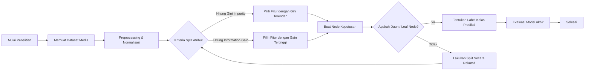

<!-- layout: title -->
<!-- logo: assets/University-logo.png -->
<!-- section: Pendahuluan -->

# TESIS
## PANDUAN PENGGUNAAN SLIDE LECTURA

>Studi Kasus: Klasifikasi Penyakit dengan Algoritma Decision Tree

<div class="title-details">
<strong>Panduan & Contoh Praktis</strong><br>
<strong>Program Studi {{studyProgram}} - {{institutionInfo}}</strong><br><br>
<strong>Dosen Pembimbing:</strong><br>
Prof. Nama Pembimbing Pertama<br>
Prof. Nama Pembimbing Kedua<br>
</div>

---slide-break---
<!-- layout: 2-content-with-text -->
<!-- title: Pendahuluan: Latar Belakang & Rumusan Masalah -->
<!-- left-title: Pengenalan Slide Lectura -->
<!-- right-title: Studi Kasus: Decision Tree -->
<!-- section: Pendahuluan -->

1.) **Sistem Slide Lectura** dirancang khusus untuk presentasi akademik (sidang tesis) dengan memadukan kemudahan menulis markdown dan kekuatan visual Reveal.js.

2.) **Visualisasi Struktur**: Slide ini dikelola oleh `script.js` dan dihias menggunakan `style.css` dengan fitur-fitur seperti Glassmorphism, Book Tabs navigasi, dan Interactive Cards.

3.) **Tujuan Panduan**: Membimbing pengguna dalam mengoptimalkan setiap layout yang tersedia menggunakan contoh penelitian klasifikasi Decision Tree.

[^1)] 1.1 Latar Belakang Slide Lectura

  <!-- split -->

**Rumusan Masalah:**
Bagaimana menyusun slide presentasi yang efektif, informatif, dan interaktif untuk memaparkan hasil penelitian pohon keputusan (*Decision Tree*)?

**Tujuan Penelitian:**
1. **RQ1 (Desain)**: Memetakan struktur materi tesis Decision Tree ke dalam template layout Lectura.
2. **RQ2 (Visualisasi)**: Menampilkan visualisasi pohon keputusan, formula matematika (Gini/Entropy), serta diagram alur training pipeline secara optimal.
3. **RQ3 (Evaluasi)**: Memvalidasi performa presentasi dengan memanfaatkan metrik visualisasi tabel booktabs dan grafik performa model.

[^2)] 1.2 Rumusan Masalah

---slide-break---
<!-- layout: 1-column-stacked -->
<!-- title: Landasan Teori: Tata Cara Metadata & Syntax -->
<!-- top-title: 1. Mengatur Konfigurasi via Metadata -->
<!-- bottom-title: 2. Cara Kerja Pemisahan Slide -->
<!-- section: Teoritis -->

- **Sintaks Komentar HTML**: Setiap slide diawali oleh metadata bertipe komentar `<!-- key: value -->` untuk mengatur properti visual.
- **Daftar Kunci Metadata**:
  - `layout`: menentukan tata letak (contoh: `title`, `1-content-with-text`, `2-content-with-text`, `1-column-stacked`, `2-content-with-img`).
  - `title`: judul slide yang akan ditampilkan di kotak melayang atas.
  - `section`: kategori menu/bab pada tab navigasi atas (*Book Tabs*).
  - `state`: atur ke `hide-header-footer` untuk menyembunyikan header/footer (misal pada slide judul/penutup).

[^1)] 2.1 Konfigurasi Slide

<!-- split -->

- **Pemisah Slide Utama**: Gunakan baris baru berisi teks `---slide-break---` (tanpa spasi tambahan) untuk menandai perpindahan antar halaman slide.
- **Pemisah Konten Internal**: Untuk layout dengan beberapa kolom atau baris (seperti `2-content-with-text` atau `1-column-stacked`), gunakan baris pemisah `<!-- split -->` di dalam konten slide untuk membagi teks ke dalam kotak akademik (`academic-box`) yang terpisah.
- **Studi Kasus Decision Tree**: Landasan teori decision tree yang panjang dapat dipecah menjadi dua bagian (misalnya: definisi tree pada bagian atas, dan metrik entropi pada bagian bawah).

[^2)] 2.2 Aturan Pemisahan Konten

---slide-break---
<!-- layout: 2-content-with-text -->
<!-- title: Metodologi: Konfigurasi Layout Stacked & Kolom -->
<!-- left-title: Desain Layout 2 Kolom -->
<!-- right-title: Studi Kasus: Alur Data Decision Tree -->
<!-- section: Metodologi -->

- **Layout `2-content-with-text`**: Membagi slide secara horizontal menjadi 2 kolom dengan ukuran lebar yang sama.
- **Keunggulan**: Sangat ideal untuk membandingkan dua konsep yang saling berhubungan, seperti perbandingan teori, atau membagi bab menjadi sub-bab terpisah.
- **Cara Menulis**:
  ```markdown
  <!-- layout: 2-content-with-text -->
  <!-- left-title: Kolom Kiri -->
  <!-- right-title: Kolom Kanan -->
  Konten Kiri
  <!-- split -->
  Konten Kanan
  ```

[^1)] 3.1 Layout 2 Kolom Horizontal

  <!-- split -->

- **Preprocessing Data**:
  Normalisasi data numerik dengan skala *Min-Max*:

$$x_{\text{norm}} = \frac{x - x_{\min}}{x_{\max} - x_{\min}}$$

- **Kriteria Split Atribut**:
  Memisahkan data latih berdasarkan perhitungan **Gini Impurity** pada setiap tingkat kedalaman pohon keputusan:

$$Gini(D) = 1 - \sum_{i=1}^{c} p_i^2$$

- **Pembagian Dataset**:
  Dataset dibagi secara stratifikasi (*Stratified Split*) dengan rasio **80% data training** dan **20% data testing**.

[^2)] 3.2 Implementasi Alur Training

---slide-break---
<!-- layout: 1-column-stacked -->
<!-- title: Metodologi: Integrasi Persamaan IEEE & Math -->
<!-- top-title: Penerapan Persamaan Bergaya IEEE -->
<!-- bottom-title: Formulasi Pembagian Node Decision Tree -->
<!-- section: Metodologi -->

- **Dukungan MathJax 3**: Anda dapat menulis rumus matematika menggunakan format LaTeX standar (`$` untuk inline matematika, dan `$$` untuk block matematika).
- **Penomoran Otomatis IEEE**: Gunakan format `$$ rumus $$ (label)` untuk membuat persamaan terformat rapi dengan nomor persamaan otomatis di sebelah kanan:

$$\Delta I(N) = I(N_p) - \frac{N_L}{N_p} I(N_L) - \frac{N_R}{N_p} I(N_R)$$ (3.1)

- Di mana $\Delta I(N)$ adalah Information Gain, $N_p$ adalah jumlah data pada parent node, $N_L$ dan $N_R$ adalah jumlah data pada anak kiri dan kanan.

[^1)] 3.3 Persamaan IEEE Lectura

<!-- split -->

- **Perhitungan Entropy (ID3)**:
  Digunakan untuk mengukur tingkat ketidakpastian atau keacakan dari sekumpulan data sebelum dan sesudah split:

$$H(D) = -\sum_{i=1}^{c} p_i \log_2 p_i$$ (3.2)

- **Gain Ratio (C4.5)**:
  Mengatasi bias Information Gain terhadap atribut yang memiliki banyak nilai unik dengan menghitung rasio informasi split intrinsik:

$$GainRatio(A) = \frac{InformationGain(A)}{SplitInfo(A)}$$ (3.3)

- Di mana $SplitInfo(A) = -\sum_{j=1}^{k} \frac{|D_j|}{|D|} \log_2 \frac{|D_j|}{|D|}$.

[^2)] 3.4 Formulasi Kriteria Split

---slide-break---
<!-- layout: 2-content-center-mermaid -->
<!-- title: Metodologi: Visualisasi Diagram Alur dengan Mermaid -->
<!-- section: Metodologi -->



<!-- split -->

- **Cara Menulis Layout `2-content-center-mermaid`**:
  - Layout ini menampilkan diagram Mermaid berukuran besar di bagian atas, dan penjelasan detail dalam kotak `academic-box` di bagian bawah.
  - Letakkan sintaks diagram Mermaid di bagian pertama (sebelum `<!-- split -->`) menggunakan tag kode ` ```mermaid `.
  - Letakkan penjelasan berupa teks markdown di bagian kedua (setelah `<!-- split -->`).
  - Diagram Mermaid di atas menggambarkan alur pembentukan pohon keputusan secara berulang (rekursif) hingga mencapai leaf node.

---slide-break---
<!-- layout: 2-content-with-img -->
<!-- image: placeholder.png -->
<!-- title: Hasil: Layout Gambar Kiri & Teks Kanan -->
<!-- section: Hasil -->

- **Konfigurasi Layout Gambar**: Menggunakan layout `2-content-with-img` dengan metadata `image: placeholder.png` (dapat berupa path gambar apa saja, di sini kita menggunakan file `placeholder.png`).
- **Tampilan Visual**: Gambar akan dimuat secara responsif di sebelah kiri, sementara teks penjelasan diletakkan di dalam `academic-box` di sebelah kanan.
- **Fitur Lightbox**: Pengguna dapat mengklik gambar di slide presentasi untuk memicu modal popup perbesaran (*lightbox*) secara dinamis.
- **Studi Kasus Decision Tree**: 
  - Gambar di sebelah kiri menyimulasikan diagram struktur pohon keputusan yang terbentuk dari proses pelatihan model.
  - Struktur pohon ini memiliki kedalaman maksimum (*max_depth*) = 5 untuk menghindari *overfitting*.
  - Node akar (*root node*) didasarkan pada fitur paling dominan, diikuti oleh sub-fitur di bawahnya.

[^1)] 4.1 Layout Gambar & Lightbox Lectura

---slide-break---
<!-- layout: 1-column-stacked -->
<!-- title: Hasil: Perbandingan Akurasi & Tabel Booktabs -->
<!-- top-title: Tabel Gaya Booktabs Akademik -->
<!-- bottom-title: Analisis Performa Decision Tree -->
<!-- section: Hasil -->

- **Sintaks Tabel Markdown**: Tabel ditulis menggunakan format pipa (`|`) markdown standar. Engine Lectura akan mengonversinya menjadi gaya publikasi **Booktabs** (hanya menggunakan garis horizontal atas, bawah, dan header; tanpa garis vertikal).

| Skenario Pengujian | Kriteria Split | Kedalaman Maksimum | Akurasi | Recall | F1-Score |
| :--- | :--- | :--- | :--- | :--- | :--- |
| Uji Coba 1 | Gini Impurity | Kedalaman 3 | 0.8542 | 0.8320 | 0.8429 |
| Uji Coba 2 | Gini Impurity | Kedalaman 5 | **0.8915** | **0.8810** | **0.8862** |
| Uji Coba 3 | Information Gain | Kedalaman 3 | 0.8410 | 0.8240 | 0.8324 |
| Uji Coba 4 | Information Gain | Kedalaman 5 | 0.8754 | 0.8640 | 0.8696 |

[^1)] 4.2 Tabel Booktabs Lectura

<!-- split -->

- **Akurasi Tertinggi**: Diperoleh pada Skenario Uji Coba 2 dengan kriteria **Gini Impurity** dan max depth **5**, menghasilkan akurasi sebesar **89.15%**.
- **Sensitivitas (Recall)**: Nilai recall sebesar **88.10%** menunjukkan model sangat handal dalam mendeteksi kelas minoritas secara tepat, meminimalkan risiko *false negative*.
- **Kesimpulan Evaluasi**: Penggunaan kriteria Gini Impurity pada dataset ini terbukti memberikan batas pemisahan keputusan (*decision boundary*) yang lebih optimal dibandingkan Information Gain.

[^2)] 4.3 Evaluasi Pengujian Model

---slide-break---
<!-- layout: 2-content-with-text -->
<!-- title: Hasil: Pengaturan Waktu & Kontrol Tema -->
<!-- left-title: Navigasi Tabs & Tombol Mulai -->
<!-- right-title: Fitur Pengaturan Waktu & Tema -->
<!-- section: Pembahasan -->

- **Book Tabs Dinamis**: Progress bar di bagian atas slide otomatis dibuat berdasarkan properti `section` pada metadata slide.
- **Status Navigasi**: Tab saat ini diberi highlight **Active**, sedangkan tab bab yang sudah dilewati akan mendapatkan indikator **Completed**.
- **Halaman Slide**: Nomor halaman di pojok kanan bawah otomatis diperbarui, atau dapat ditentukan manual dengan metadata `page: X`.
- **Card Interaction**: Kotak `academic-box` memberikan efek hover halus (*shadow* dan *scaling*) saat disentuh atau diarahkan kursor.

[^1)] 5.1 Navigasi & Interaksi Slide

  <!-- split -->

- **Waktu Presentasi Terintegrasi**:
  Durasi diatur di `config.json` via parameter `presentationMinutes`. Klik tombol **START** untuk memulai hitung mundur, dan **RESET** untuk mengulang kembali.
- **Alert Mode Otomatis**:
  Ketika waktu tersisa $\le$ 2 menit (120 detik), timer akan masuk ke *Alert Mode* dengan efek visual berkedip (*pulsing*) berwarna merah crimson untuk memperingatkan presenter.
- **Peralihan Tema (Dark/Light)**:
  Gunakan tombol ikon matahari/bulan di sebelah kanan timer untuk berganti antara mode gelap (glassmorphic dark) dan mode terang (akademik bersih). Pilihan tema tersimpan di *local storage*.

[^2)] 5.2 Fitur Timer & Dark/Light Mode

---slide-break---
<!-- layout: 1-column-stacked -->
<!-- title: Pembahasan: Implikasi Hasil & Studi Kasus -->
<!-- top-title: Implikasi Teoritis & Praktis -->
<!-- bottom-title: Rekomendasi Teknis -->
<!-- section: Pembahasan -->

- **Integrasi Teori**: Hasil pengujian memperkuat teori bahwa Decision Tree dengan pembatasan kedalaman (pruning/max depth) sangat efektif dalam mengatasi variansi data tinggi tanpa mengorbankan interpretability.
- **Pemanfaatan Praktis**: Model Decision Tree yang terbentuk memiliki karakteristik *white-box*, sehingga mudah diubah menjadi aturan logis (*IF-THEN Rules*) untuk diintegrasikan ke dalam sistem pakar klinis.
- **Efisiensi Presentasi**: Layout Lectura mempermudah dosen penguji untuk melihat hubungan langsung antara pemodelan matematis dengan hasil pengujian nyata.

[^1)] 5.3 Implikasi Penelitian

<!-- split -->

- **Hyperparameter Tuning**: Direkomendasikan untuk mengeksplorasi teknik *cost-complexity pruning* demi menyeimbangkan ukuran pohon dengan tingkat kesalahan klasifikasi secara otomatis.
- **Pola Penulisan**: Penulisan markdown yang ringkas di `content.md` mempermudah pemeliharaan dokumen slide presentasi tesis secara kolaboratif.
- **Optimasi Presentasi**: Presenter sebaiknya menekan tombol **START** sesegera mungkin saat sesi presentasi dimulai agar alokasi waktu berjalan teratur.

[^2)] 5.4 Rekomendasi Teknis

---slide-break---
<!-- layout: closing -->
<!-- section: Penutup -->

# TERIMA KASIH
## Sesi Diskusi & Tanya Jawab

<div class="title-details">
<strong>Panduan Penggunaan Slide Lectura</strong><br>
Studi Kasus: Machine Learning Decision Tree<br><br>
{{institutionInfo}}
</div>
