<!-- layout: title -->
<!-- logo: assets/udinus-logo.png -->
<!-- section: Pendahuluan -->

# TESIS
## ARSITEKTUR HIBRIDA Q-LEARNING DAN LARGE LANGUAGE MODELS (LLM) UNTUK INTELLIGENT TUTORING SYSTEM (ITS) DENGAN KEBIJAKAN PEDAGOGIS ADAPTIF

<strong>{{authorName}}</strong> 
<strong>{{studentId}}</strong>  
<strong>Program Studi {{studyProgram}} — {{institutionInfo}}</strong>  
<strong>Dosen Pembimbing:</strong> 
Prof. Dr. Pulung Nurtantio Andono, S.T., M.Kom. 
Dr. Ir. Pujiono, S.Si., M.Kom., IPM., ASEAN Eng 

---slide-break---
<!-- layout: 2-content-with-text -->
<!-- title: Pendahuluan: Urgensi & Masalah Penelitian -->
<!-- section: Pendahuluan -->
<!-- left-title: Latar Belakang -->
<!-- right-title: Rumusan Masalah -->

1.) **Kurikulum Merdeka** memberi tujuan yaitu metode mengajar yang **berdiferensiasi**. Namun Kondisi kelas yang heterogen, dan karakter siswa yang berbeda-beda.

2.) **Mengimplementasi - Intelligent Tutoring System (ITS)** dengan dua aspek:
    - Decision Engine : algoritma Reinforcement Learning (RL).
    - Communication engine : Large Languange Models (LLM).

3.) **ITS berlandaskan Teori Pedagogis** :
    - Zone Proximal Development (ZPD),
    - Kontruktivisme,
    - Cognitive Load Theory (CLT)

[^1)] 1.1 Latar Belakang

<!-- split -->

**Masalah Utama:**
Belum Terintegrasikannya antara kemampuan adaptasi strategis **(RL)** berdasarkan teori pedagogis dan interaksi natural **(LLM)**.

**Research Questions:**

1. **RQ1 (Desain)**: Bagaimana merancang arsitektur hibrida **RL-LLM** yang mampu mendukung ITS yang adaptif terhadap siswa?
2. **RQ2 (Implementasi)**: Bagaimana mengimplementasikan **RL** dengan respons **LLM** sebagai chatbot?
3. **RQ3 (Evaluasi)**: Bagaimana mengevaluasi teknis **RL** dan efek penerimaan pengguna menggunakan evaluasi **(TAM-LM)?**

[^2)] 1.2 Rumusan Masalah

---slide-break---
<!-- layout: 1-column-stacked -->
<!-- title: Landasan Teori: Pedagogi, Arsitektur ITS & Hibridasi -->
<!-- section: Teoritis -->
<!-- top-title: 1. Landasan Teori Pedagogis -->
<!-- bottom-title: 2. Komponen Utama Arsitektur ITS -->

**1. Landasan Teori Pedagogis:**
- **Zone Proksimal Development (Vygotsky)**: Kerangka bimbingan pada zona perkembangan siswa.
- **Kontruktivisme (Fosnot)**: Siswa berperan aktif dalam membangun pengetahuannya.
- **Cognitive Load Theory (Sweller)**: Pengelolaan beban kognitif melalui reduksi beban pemikiran.

[^1)] 2.2 Landasan Teori Pedagogis

<!-- split -->

**2. Komponen Utama Arsitektur ITS:**
1.  **Model Domain**: Sumber pengetahuan : materi pembelajaran seperti bahan ajar, modul (menggunakan **RAG**).
2.  **Model Siswa**: Representasi kondisi kognitif dan progres siswa.
3.  **Model Pedagogis**: Strategi pengajaran dan pengambilan keputusan (menggunakan **RL**).
4.  **Model Antarmuka**: Jembatan komunikasi cerdas (menggunakan **LLM**).

[^2)] 2.3 Intelligent Tutoring System (ITS)

---slide-break---
<!-- layout: 1-column-stacked -->
<!-- title: Metodologi: Mekanisme Adaptif Skor $z_t$ -->
<!-- section: Metodologi -->
<!-- top-title: 1. Deteksi Kognitif (CWLL) -->
<!-- bottom-title: 2. Transformasi Sigmoid & Diskritisasi -->

Mekanisme **Adaptif** berfungsi sebagai deteksi kognitif untuk mengukur kondisi siswa secara langsung melalui tahap:

1. **Confidence Weighted Lead Lag (CWLL)**:
   Berfungsi pengontrol jalur progres jangka pendek dan jangka panjang dengan pembobotan ($\lambda$):

$$C_t = p_t + \lambda(q_t - p_t), \lambda=0.25$$ (3.1)

*$\lambda=0.25$ dipilih secara empiris untuk menyeimbangkan stabilitas historis.*

[^1)] 3.8.2 Mekanisme Skor Adaptif ($z_t$)

<!-- split -->

2. **Transformasi Sigmoid**:
   Berfungsi normalisasi respons kognitif ke dalam ruang state [0,1]:

$$z_{\text{raw}} = \frac{1}{1+e^{-8.0(c_t-0.50)}}$$ (3.2)

$$z_{t}= \beta_z z_t-1+(1-\beta_z)z_{\text{raw}}$$ (3.3)

3. **Diskritisasi State**:
   Nilai kontinu $z_t$ dipetakan ke dalam **4 level ZPD (ZPD-0 hingga ZPD-3)** untuk mendukung algoritma **Tabular Q-Learning**.

[^2)] 3.9 Adaptive Agent

---slide-break---
<!-- layout: 1-column-stacked -->
<!-- title: Metodologi: Desain Eksperimen & Evaluasi -->
<!-- section: Metodologi -->
<!-- top-title: Desain Eksperimen (Reinforcement Learning) -->
<!-- bottom-title: Desain Analisis Penerimaan (TAM-LM) -->

**Eksperimen Komparatif (Parameter & Fungsi):**

| Parameter / Aspek | Kelompok Uji (Agen Adaptif) | Kelompok Kontrol (Agen Statis) | Fungsi & Peran |
| :--- | :--- | :--- | :--- |
| **Laju Belajar ($\alpha_t$)** | $\alpha_t = \alpha_{\min} + (\alpha_{\max}-\alpha_{\min}) (1-z_t)^{p_{\alpha}}$ | $\alpha_t = \alpha_{\min} + (\alpha_0 - \alpha_{\min}) (1 - \frac{t}{T})$ | Penyerapan informasi dinamis vs peluruhan linier non-adaptif |
| **Diskon ($\gamma_t$)** | $\gamma_t = \gamma_{\min} + (\gamma_{\max}-\gamma_{\min}) (1-z_t)^{p_{\gamma}}$ | $\gamma = 0{,}65$ (konstan) | Perencanaan taktis adaptif (*ZPD scaling*) vs horizon tetap |
| **Eksplorasi ($\epsilon_t$)** | $\epsilon_t = \epsilon_{\min} + (\epsilon_{\max}-\epsilon_{\min})(1-z_t)^{3{,}0}$ | $\epsilon_t = \epsilon_{\min} + (\epsilon_0 - \epsilon_{\min}) (1 - \frac{t}{T})$ | Eksplorasi sensitif kemahiran (*power scaling*) vs peluruhan linier |
| **Pembaruan Nilai-Q** | **Dual Update**: Lokal (hard clamping) + Global $Q_{\text{agg}}$ (soft projection $\Psi$) | **Single Update**: Lokal dengan hard clamping saja | Regulasi kualitas kebijakan makro vs estimasi lokal saja |

**Konfigurasi Mode Lingkungan:**

| Mode Eksperimen | Persamaan / Parameter Uji | Deskripsi & Fungsi |
| :--- | :--- | :--- |
| **Realistik (Active Noise)** | $P_{\text{mood}} = 0{,}25$, $P_{\text{fail}} = 0{,}10$, $P_{\text{degrad}} = 0{,}30$ | Simulasi ketidakpastian siswa untuk menguji ketangguhan (*robustness*) agen |
| **Pragmatik (Inactive Reward)** | Kondisi terkontrol; penalti bernilai positif/dikurangi | Isolasi performa untuk memvalidasi efektivitas adaptasi parameter murni |

  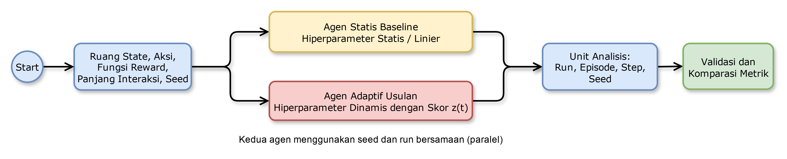

[^1)] 4.1 Konfigurasi Eksperimen

<!-- split -->

**Evaluasi Technology Acceptance Model – Learning Motivation (TAM-LM)**.
- **Subjek**: Siswa tingkat menengah atas ($n = 100$). *Sampel memenuhi kriteria Hair et al. (min. 5x jumlah indikator).*
- **Konstruk Variabel**:
| Kontruk                                 | Variabel |
| --------------------------------------- | -------- |
| Kemudahan penggunaan yang dirasakan     | PEOU     |
| Kegunaan yang Dirasakan                 | PU       |
| Sikap atau perspektif penggunaan        | ATU      |
| Niat dan kesan penggunaan berkelanjutan | BI       |

 **Instrumen evaluasi**: Menggunakan *Software* JASP untuk uji SEM, validitas, reliabilitas, *goodness of fit*, dan pengujian hipotesis.

  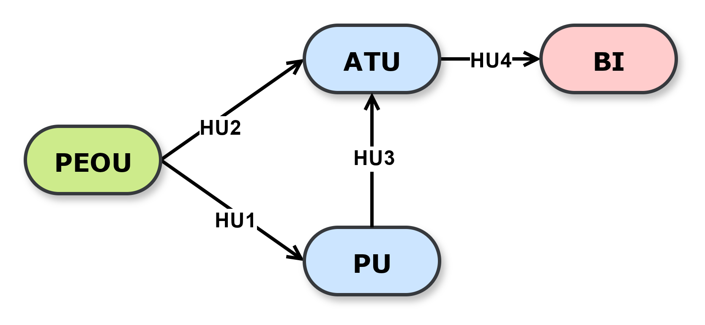

[^2)] 3.15 Teknik Analisis Data

---slide-break---
<!-- layout: 2-content-center-mermaid -->
<!-- title: Metodologi: Alur Kerja Arsitektur MAESTRO -->
<!-- section: Metodologi -->

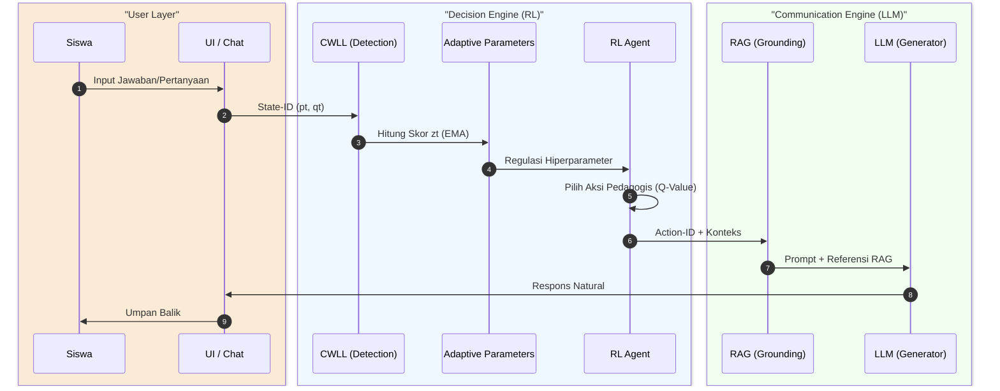

<!-- split -->

**(MAESTRO) Multi‑dimensional Adaptive Educational System with Temporal Reinforcement Optimization**

---slide-break---
<!-- layout: 1-column-stacked -->
<!-- title: Hasil & Analisis: Performa & Efisiensi RL -->
<!-- section: Hasil RL -->
<!-- top-title: Visualisasi Performa (Reward & Q-Value) -->
<!-- bottom-title: Tabel Ringkasan Metrik Evaluasi -->

  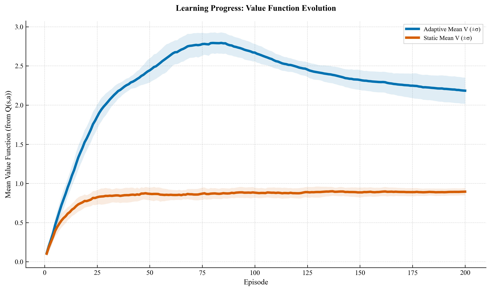
  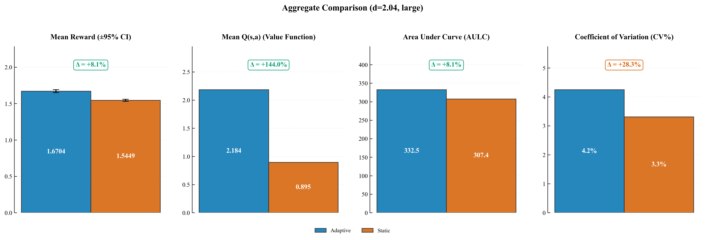

[^1)] Gambar 4.1 Magnitudo Q-Value & Metrik Bar

<!-- split -->

| Metrik Evaluasi    | Agen Adaptif | Agen Statis | Delta                 | Statistik        |
| :----------------- | :----------- | :---------- | :-------------------- | :--------------- |
| **Mean Reward/Ep** | 1,6704       | 1,5449      | **+8,10%**            | $p \approx 0,00$ |
| **AULC**           | 332,455      | 307,406     | **+8,15%**            | $p \approx 0,00$ |
| **Mean Q-Value**   | 2,1840       | 0,8951      | **+144,0%**           | *Optimisme Tinggi* |
| **Cohen's $d$**    | 2,035        | --          | **Efek sangat besar** | --               |

**Interpretasi Q-Value**: Lonjakan **+144%** pada Q-Value menunjukkan peningkatan estimasi nilai jangka panjang (*Expected Return*) yang jauh lebih stabil dan optimis berkat regulasi parameter $\gamma$ dan $\alpha$.

- **Uji Bootstrap**: Selisih reward 0,024 dengan CI 95% [0,019; 0,029] , seluruhnya diatas nol, mengonfirmasi stabilitas terhadap variasi *run-seeds*.

[^2)] Tabel 4.2 Ringkasan Performa & Analisis Ablasi 4.3

---slide-break---
<!-- layout: 1-column-stacked -->
<!-- title: Hasil & Analisis: Kebijakan & Dinamika RL -->
<!-- section: Hasil RL -->
<!-- top-title: Visualisasi Kebijakan (Heatmap & Korelasi) -->
<!-- bottom-title: Dinamika Parameter & Konvergensi -->

  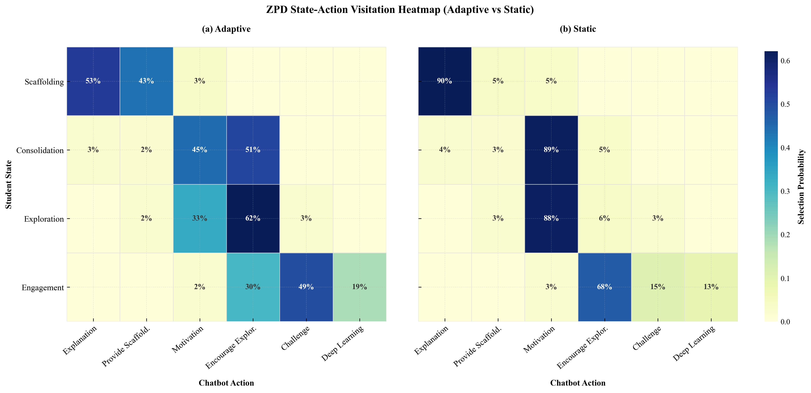
  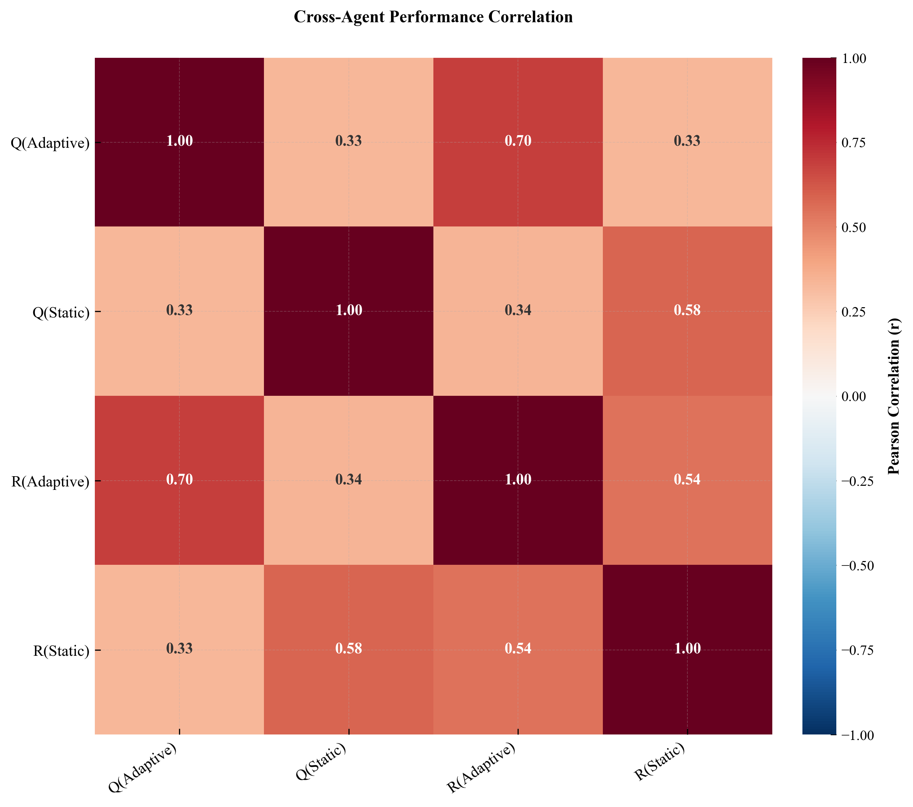

**Analisis Kebijakan**: Pola diagonal pada heatmap (Sumbu X: Aksi; Sumbu Y: State $z_t$) membuktikan transisi bantuan (**Scaffolding ZPD**) yang tepat: semakin tinggi kemahiran ($z_t$), bantuan semakin dikurangi. Korelasi Reward–Q sebesar **0,70** mengonfirmasi ketepatan tindakan.

<!-- split -->

  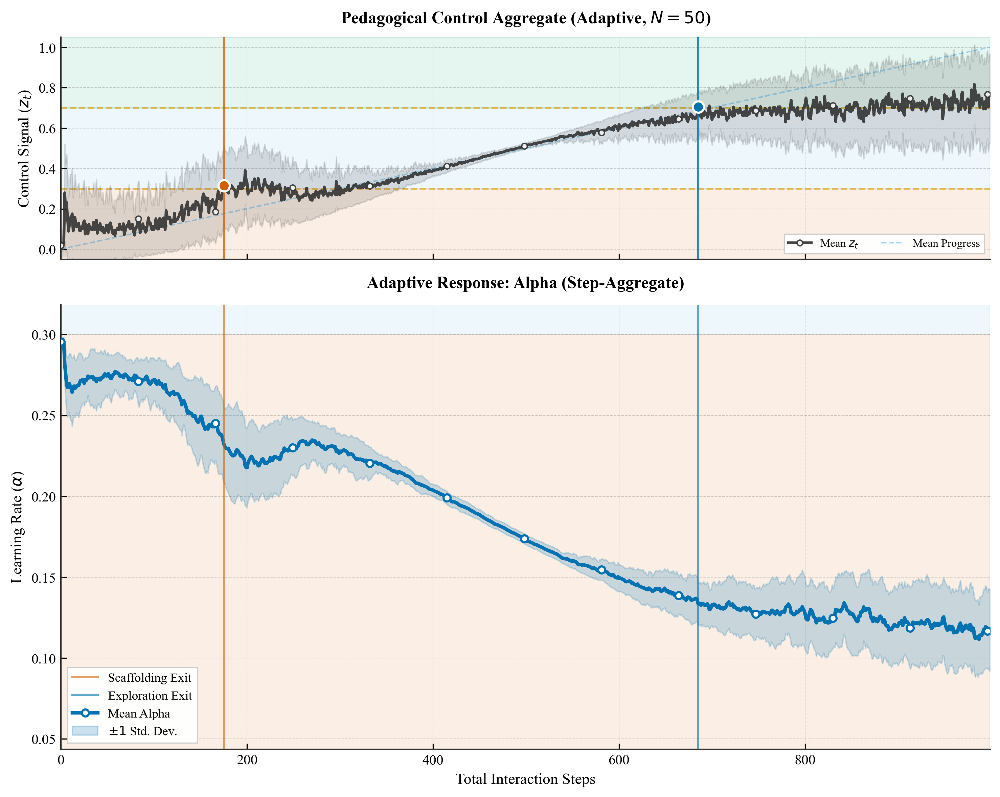
  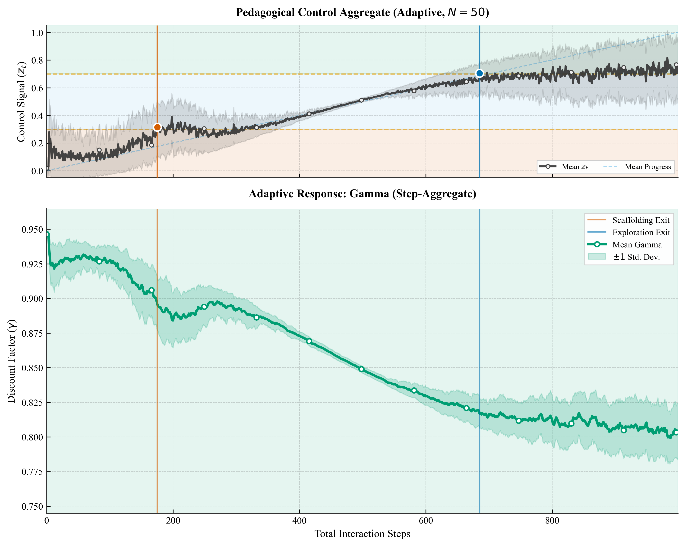
  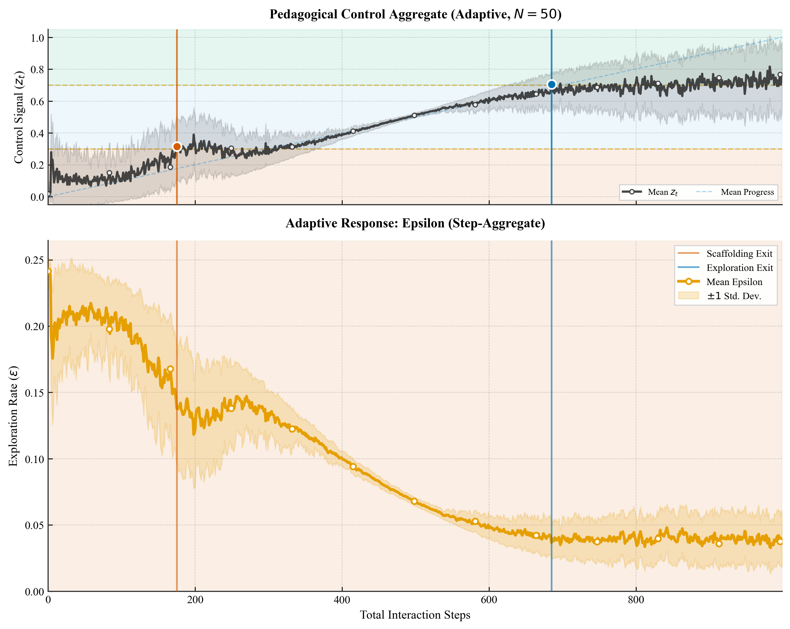
  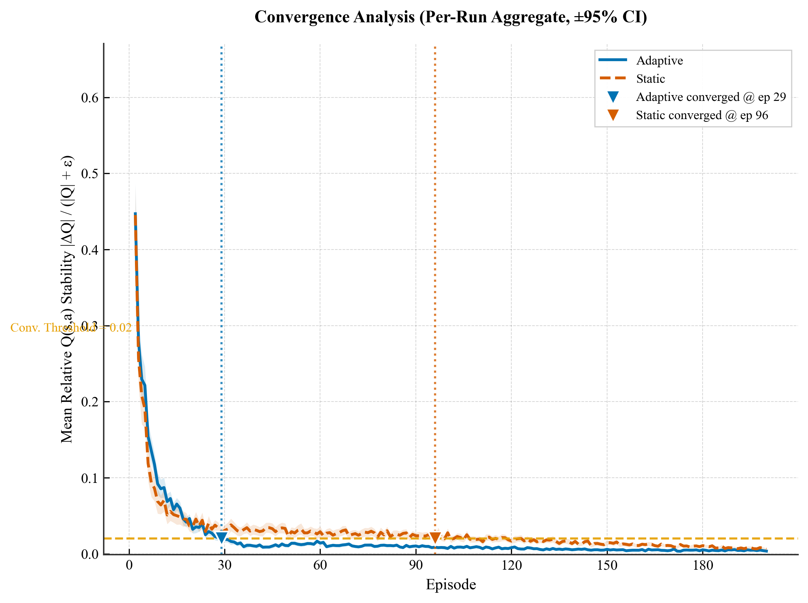

**Analisis Dinamika**: Laju belajar ($\alpha$) dan eksplorasi ($\epsilon$) beradaptasi sensitif terhadap $z_t$. Agen Adaptif mencapai kestabilan ***Bellman error*** pada **episode ke-33** dengan 'threshold=2%'.

[^1)] Gambar 4.2 Trajektori Parameter & 4.3 Heatmap

---slide-break---
<!-- layout: 1-column-stacked -->
<!-- title: Hasil & Implementasi: Sinkronisasi & Prototipe -->
<!-- section: Hasil RL -->
<!-- top-title: Sinkronisasi RL-LLM (Decision & Communication Engine) -->
<!-- bottom-title: Prototipe Sistem MAESTRO (Akses Publik) -->

  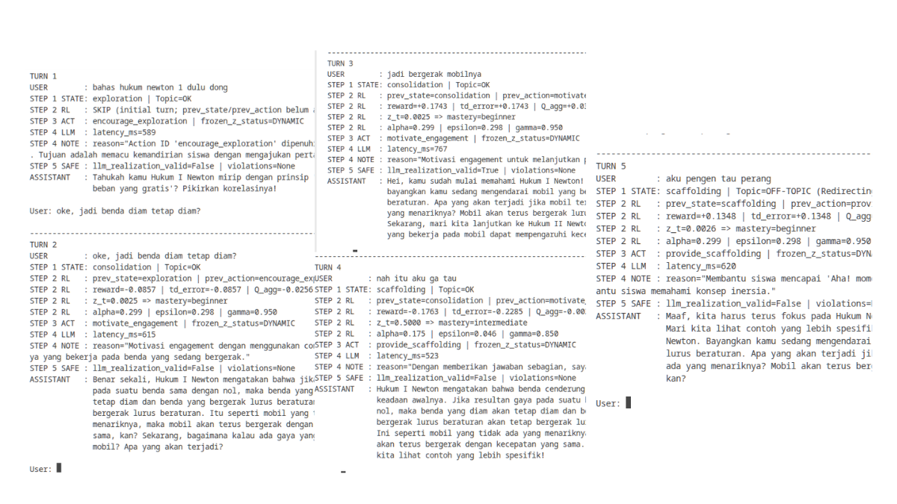

**Interpretasi Sinkronisasi:**
- **Aksi $\to$ Prompt**: Action-ID diterjemahkan menjadi *System Instruction* (Constraint) bagi LLM untuk menjamin koridor pedagogis.
- **Keterlusuran**: Keputusan transparan melalui integrasi state kognitif ($z_t$).
- **Integritas Konteks**: RAG memastikan dialog terikat pada basis pengetahuan materi.

[^1)] Tabel 4.4 Log RL–LLM & 4.6 Grounding

<!-- split -->

  
  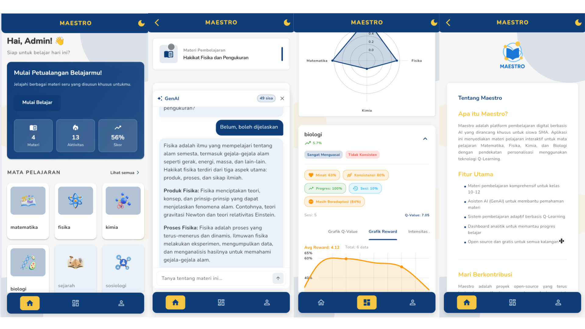

> **Akses Sistem:** [maestro-4dcce.web.app](https://maestro-4dcce.web.app)
> **Kredensial Demo:** `admin@mail.com` | `admin123`

---slide-break---
<!-- layout: 1-column-stacked -->
<!-- title: Hasil TAM-LM: Analisis Model & Hipotesis -->
<!-- section: Hasil Pedagogis -->
<!-- top-title: Kualitas Model Pengukuran (Validitas & Reliabilitas) -->
<!-- bottom-title: Kelayakan Model (GoF) & Uji Hipotesis -->

**Statistik Instrumen:**
- **Validitas Konvergen**: AVE = 0,856–0,892 ($> 0,50$); *Factor loading* 0,921–0,960.
- **Reliabilitas Konstruk**: CR = 0,959–0,971 ($> 0,70$), konsistensi internal sangat kuat.
- **Validitas Diskriminan**: HTMT < 0,90 (Memenuhi kriteria).

<!-- split -->

  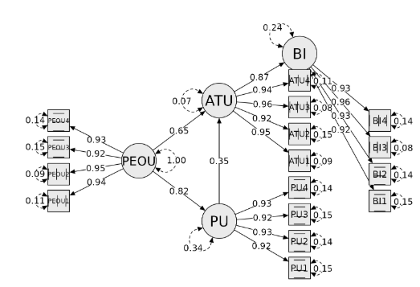

**1. Kelayakan Model (Goodness of Fit):**

| Kriteria  | Hasil | Standar | Keterangan   |
| :-------- | :---- | :------ | :----------- |
| CFI       | 1,000 | > 0,90  | Sangat Baik  |
| RMSEA     | 0,000 | < 0,08  | Sangat Baik  |
| SRMR      | 0,038 | < 0,08  | Sangat Baik  |
| $p$-value | 0,962 | > 0,05  | Fit Sempurna |

> **Interpretasi:** Model TAM-LM memiliki tingkat kecocokan yang sangat tinggi (sangat baik) dengan data empiris lapangan ($n=100$ valid secara statistik).

**2. Uji Hipotesis Jalur Struktural:**

| Kode | Jalur Hubungan | Koef. ($\beta$) | $z$-stat | Keputusan    |
| :--- | :------------- | :-------------- | :------- | :----------- |
| HU1  | PEOU $\to$ PU  | 0,815           | 17,47    | **Diterima** |
| HU2  | PEOU $\to$ ATU | 0,653           | 6,80     | **Diterima** |
| HU3  | PU $\to$ ATU   | 0,353           | 3,57     | **Diterima** |
| HU4  | ATU $\to$ BI   | 0,875           | 29,45    | **Diterima** |

> **Interpretasi:** Seluruh hipotesis diterima secara signifikan ($p < 0,001$). Sikap pengguna (ATU) merupakan prediktor terkuat terhadap niat penggunaan berkelanjutan (BI).

[^1)] Tabel 5.1–5.6 Analisis TAM-LM

---slide-break---
<!-- layout: 1-column-stacked -->
<!-- title: Diskusi: Temuan Utama & Perbandingan SOTA -->
<!-- section: Diskusi -->
<!-- top-title: Ringkasan Temuan Penelitian -->
<!-- bottom-title: Perbandingan State-of-the-Art (SOTA) -->

| Rumusan Masalah (RQ)                   | Temuan Utama                                                                                                         | Implikasi                                                                                                                                               |
| :------------------------------------- | :------------------------------------------------------------------------------------------------------------------- | :------------------------------------------------------------------------------------------------------------------------------------------------------ |
| RQ1: Merancang Arsitektur Hibrida      | Pemisahan fungsi *decision engine* dan *communication engine*; Aksi RL diproses oleh LLM sebagai interaksi           | Memperbaiki instruksional jangka panjang sesuai teori pedagogis yaitu interaksi pembelajaran berbasis LLM sesuai tujuan differensiasi kurikulum merdeka |
| RQ2: Implementasi Bukti ablasi ($z_t$) | $z_t$ sebagai variabel kendali yang mengintegrasikan hiperparameter; pembekuan $z$ mengakibatkan menurunkan performa | Fungsi ($z_t$) digunakan untuk menghindari degradasi performa sesuai dengan Teori ZPD, CLT dan kontruktivisme                                           |
| RQ3: Evaluasi Agen Adaptif             | Agen Adaptif unggul terhadap metrik performa dan pada evaluasi TAM-LM dapat diterima pengguna                        | Kinerja algoritmik yang stabil berkontribusi pada niat penggunaan berkelanjutan sehingga dapat diimplementasikan dengan konsep kurikulum                |

<!-- split -->

| Fitur / Kriteria | MAESTRO         | Borchers (2025) | Doroudi (2019) | Wei (2026)  |
| :--------------- | :-------------- | :-------------- | :------------- | :---------- |
| **Keputusan**    | RL Adaptif      | LLM Reaktif     | RL Statis      | RL Adaptif  |
| **Communication**| Natural LLM     | Natural LLM     | Kaku           | Natural LLM |
| **Parameter**    | Dinamis ($z_t$) | --              | Statis         | Statis      |
| **Safety**       | C1--C4          | Terbatas        | Tidak Ada      | Reward ZPD  |
| **Mitigasi**     | RAG             | Prompting       | --             | Terbatas    |

[^1)] 5.9 Pembahasan & Tabel 6.1 SOTA

---slide-break---
<!-- layout: 3-content-with-text -->
<!-- title: Penutup: Kesimpulan & Rekomendasi -->
<!-- section: Penutup -->
<!-- left-title: Kesimpulan Utama -->
<!-- center-title: Kelemahan Penelitian -->
<!-- right-title: Rekomendasi Penelitian -->

- Integrasi hibrida RL-LLM (MAESTRO) terbukti efektif menghubungkan kecerdasan strategis & komunikatif.
- Performa meningkat (**+8,10%** *Mean Reward*, **+144,0%** *Q-Value*) & diterima sangat baik ($R^2$ ATU = **0,928**).
- Menjembatani teori konstruktivis dengan AI modern untuk bimbingan personal yang berdiferensiasi.

[^1)] Bab 6 Penutup

<!-- split -->

- Validasi empiris saat ini masih terbatas pada lingkup mata pelajaran IPA di tiga sekolah menengah.
- Algoritma berbasis **Tabular Q-Learning** memiliki potensi hambatan skalabilitas pada ruang keadaan luas.
- Ketergantungan pada mekanisme RAG ringan belum sepenuhnya memitigasi risiko ketidakakuratan kontekstual.

<!-- split -->

- Perluasan uji coba ke jenjang pendidikan lain (SMP/SMK) dan domain materi (Sosial/Humaniora).
- Transisi menuju **Deep Reinforcement Learning (Deep RL)** untuk menangani ruang keadaan kompleks/kontinu.
- Studi longitudinal untuk mengevaluasi dampak jangka panjang terhadap pembentukan kemandirian belajar siswa.

---slide-break---
<!-- layout: closing -->
<!-- section: Penutup -->
<!-- state: hide-header-footer -->

# TERIMA KASIH
## Sesi Diskusi & Tanya Jawab

<strong>Praditya Wicaksono</strong> 
P31.2024.02610

